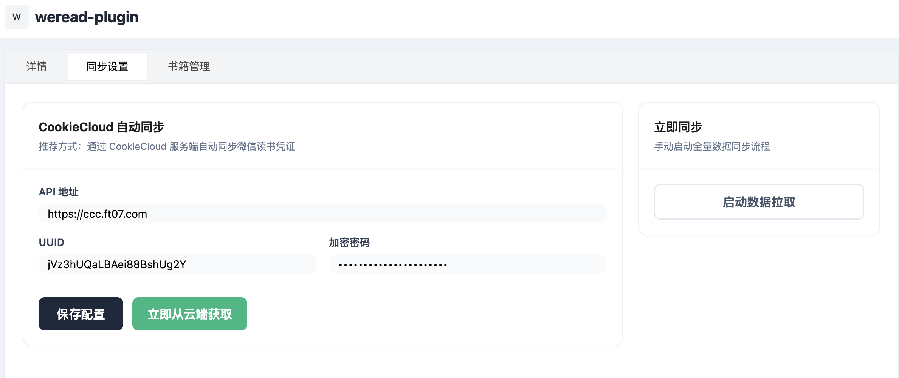
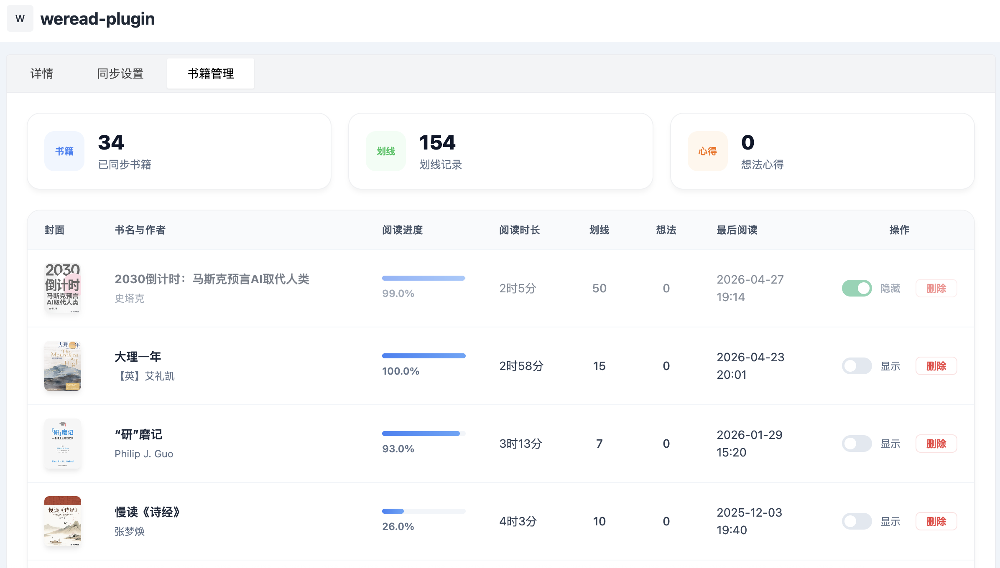
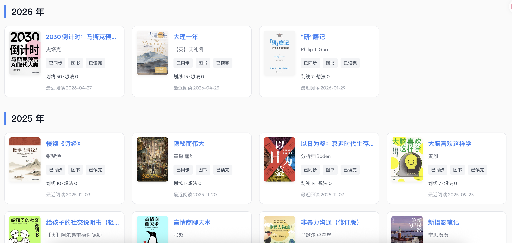

# WeRead Plugin for Halo

一个功能强大的 Halo 博客插件，将您的微信读书（WeRead）数据集成到个人博客中。通过深度同步书架、阅读进度及书籍元数据。

## 核心特性

*   **全自动数据同步**: 依托于强大的后台逻辑，插件可自动从微信读书拉取最新的书架信息、阅读时长及详细进度。
*   **CookieCloud 深度集成**: 彻底解决手动更新 Cookie 的烦恼。支持配置 CookieCloud 服务端，实现凭证的自动化更新与端到端维护。
*   **高性能同步策略**: 采用全量书架预加载技术，有效减少 API 请求频次，提升同步效率并降低封禁风险。
*   **多维度元数据**: 同步包含作者、出版信息、ISBN、总字数、笔记数、评论数及分类在内的完整数据。

## 预览
设置界面

书籍管理界面

前端展示


> [!NOTE]
> 前端展示效果建议配合适配的主题或自定义页面使用，以获得最佳视觉体验。

## 安装指南

### 环境要求
*   Halo 版本: >= 2.23.0

### 手动安装
1. 下载插件的 JAR 包（例如 `halo-weread-plugin-x.y.z.jar`）。
2. 进入 Halo 控制台 -> 插件 -> 安装。
3. 选择下载好的 JAR 文件上传并启用。

## 配置说明

启用插件后，请前往“插件配置”页面完成初始化：

### 凭证配置
本插件推荐使用 **CookieCloud** 实现凭证的自动获取与长期维护：
*   **自动获取**: 配置 CookieCloud 相关信息（API 地址、UUID、加密密码），插件将自动同步并维护您的微信读书凭证。

### 2. 数据同步
*   配置完成后，点击“启动数据拉取”即可立即触发同步。
*   插件会自动管理后续的数据更新。

## 技术亮点

*   **异步响应式架构**: 基于 Project Reactor 栈开发，确保在高并发数据同步时系统依然保持轻量且响应迅速。
*   **鲁棒的容错机制**: 内置 Cookie 自动刷新逻辑，当遇到 401 错误时自动尝试补全凭证，增强同步稳定性。
*   **精细化数据映射**: 针对不同类型的书籍 ID 实现了复杂的 URL 哈希映射算法。

## 前端集成

您可以将以下代码片段添加到您的主题模板或自定义页面中，以实现访客免登录查看书架：

```html
<!-- 微信读书书架容器 -->
<div id="weread-shelf-wrapper">加载中...</div>

<script>
  fetch('/apis/run.halo.plugin.wereadplugin/v1beta1/wereadbooks?size=1000')
    .then(res => res.json())
    .then(data => {
      const books = data.items || [];
      if (books.length === 0) {
        document.getElementById('weread-shelf-wrapper').innerHTML = '暂无书籍';
        return;
      }

      // 排序：按阅读时间倒序
      books.sort((a, b) => (b.spec.lastReadTime || 0) - (a.spec.lastReadTime || 0));

      // 分组：按年份
      const yearGroups = {};
      books.forEach(book => {
        const time = book.spec.lastReadTime;
        const year = time ? new Date(time).getFullYear() : "其他";
        if (!yearGroups[year]) yearGroups[year] = [];
        yearGroups[year].push(book);
      });

      const formatDate = (ts) => {
        if (!ts) return "未知";
        const d = new Date(ts);
        return `${d.getFullYear()}-${String(d.getMonth() + 1).padStart(2, '0')}-${String(d.getDate()).padStart(2, '0')}`;
      };

      // 注入样式
      let html = `
        <style>
        @import url('https://fonts.googleapis.com/css2?family=Outfit:wght@400;500;600&display=swap');
        .wr-container { font-family: 'Outfit', system-ui, sans-serif; --wr-accent: #3b82f6; color: #111827; }
        .wr-year-group { margin-bottom: 40px; }
        .wr-year-title { font-size: 1.5rem; font-weight: 600; margin-bottom: 20px; border-left: 4px solid var(--wr-accent); padding-left: 15px; }
        .wr-grid { display: grid; grid-template-columns: repeat(auto-fill, minmax(280px, 1fr)); gap: 20px; }
        .wr-card { display: flex; background: #fff; border: 1px solid #e5e7eb; border-radius: 12px; padding: 12px; transition: all 0.3s; cursor: pointer; }
        .wr-card:hover { border-color: var(--wr-accent); box-shadow: 0 10px 15px -3px rgba(0, 0, 0, 0.05); transform: translateY(-2px); }
        .wr-card-cover { width: 85px; height: 120px; object-fit: cover; border-radius: 6px; box-shadow: 0 4px 6px rgba(0,0,0,0.05); flex-shrink: 0; }
        .wr-card-content { margin-left: 15px; flex-grow: 1; display: flex; flex-direction: column; justify-content: space-between; overflow: hidden; }
        .wr-card-title { font-weight: 600; font-size: 1.05rem; white-space: nowrap; overflow: hidden; text-overflow: ellipsis; color: var(--wr-accent); }
        .wr-card-author { font-size: 0.85rem; color: #6b7280; margin: 4px 0; white-space: nowrap; overflow: hidden; text-overflow: ellipsis; }
        .wr-tag-row { display: flex; gap: 8px; margin-top: 5px; }
        .wr-tag { background: #f3f4f6; color: #4b5563; font-size: 0.75rem; padding: 2px 8px; border-radius: 4px; font-weight: 500; }
        .wr-stats-row { font-size: 0.8rem; color: #4b5563; margin-top: 10px; }
        .wr-time-row { font-size: 0.8rem; color: #9ca3af; margin-top: 5px; }
        .wr-modal { display:none; position:fixed; z-index:1000; left:0; top:0; width:100%; height:100%; background: rgba(0,0,0,0.5); backdrop-filter: blur(4px); align-items:center; justify-content:center; }
        .wr-modal-content { background:white; width:90%; max-width:600px; max-height:80vh; border-radius:16px; position:relative; overflow-y:auto; padding:30px; box-shadow: 0 25px 50px -12px rgba(0,0,0,0.25); }
        .wr-close { position:absolute; right:20px; top:15px; font-size:24px; cursor:pointer; color:#9ca3af; }
        </style>
        <div class="wr-container">
      `;

      // 渲染分组内容
      Object.keys(yearGroups).sort((a,b)=>b-a).forEach(year => {
        html += `
          <div class="wr-year-group">
            <h2 class="wr-year-title">${year} 年</h2>
            <div class="wr-grid">
              ${yearGroups[year].map(book => `
                <div class="wr-card" onclick="window.showBookDetail('${book.metadata.name}')">
                  
                  <div class="wr-card-content">
                    <div class="wr-card-title">${book.spec.title}</div>
                    <div class="wr-card-author">${book.spec.author}</div>
                    <div class="wr-tag-row">
                      <span class="wr-tag">已同步</span><span class="wr-tag">图书</span>
                      <span class="wr-tag">${book.spec.readInfo === 3 ? '已读完' : '在读'}</span>
                    </div>
                    <div class="wr-stats-row">划线 ${book.spec.noteCount || 0} · 想法 ${book.spec.reviewCount || 0}</div>
                    <div class="wr-time-row">最近阅读 ${formatDate(book.spec.lastReadTime)}</div>
                  </div>
                </div>
              `).join('')}
            </div>
          </div>
        `;
      });

      html += `
        </div>
        <!-- 详情弹窗 -->
        <div id="wrModal" class="wr-modal" onclick="if(event.target==this)this.style.display='none'">
          <div class="wr-modal-content">
            <span class="wr-close" onclick="document.getElementById('wrModal').style.display='none'">&times;</span>
            <div id="wrModalBody">加载中...</div>
          </div>
        </div>
      `;

      document.getElementById('weread-shelf-wrapper').innerHTML = html;

      // 弹窗控制函数
      window.showBookDetail = function(id) {
        document.getElementById('wrModal').style.display = 'flex';
        document.getElementById('wrModalBody').innerHTML = '<div style="text-align:center;padding:50px;">已加载该书籍元数据，划线与评论同步功能持续开发中...</div>';
      };
    })
    .catch(err => {
      document.getElementById('weread-shelf-wrapper').innerHTML = '书架加载失败';
    });
</script>
```

## 常见问题 (FAQ)

**Q: 什么是 CookieCloud?**
A: CookieCloud 是一个简单易用的端到端加密 Cookie 同步工具。它可以配合浏览器插件，在您的浏览器登录状态更新时自动将最新凭证同步到 Halo 插件中，彻底解决微信读书凭证易失效的问题。

## 许可证

本项目基于 MIT 协议开源。详情请参阅 [LICENSE](LICENSE) 文件。